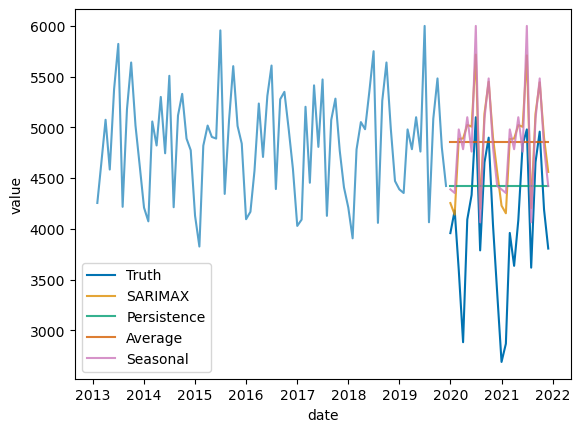

# Digital Product School Challenge

[Digital Product School (DPS)](https://www.digitalproductschool.io/) is a 3 months training program to empower the next generation of digital product makers, where diverse and cross-functional teams solve real-world challenges.

This repository contains what I developed as the AI Track challenge. The challenge is to predict the `total` number of accidents (under `accident_type`) in Munich for the year of 2020.

## Data

> The monthly traffic accidents data set includes: traffic accidents, escape accidents and alcohol accidents.

The dataset used can be both explored online and downloaded via [dataset](https://opendata.muenchen.de/dataset/monatszahlen-verkehrsunfaelle/resource/40094bd6-f82d-4979-949b-26c8dc00b9a7).

As the quote indicates, this data represents traffic accidents. Although there are other columns in the dataset, only the first five columns were considered: `category`, `accident_type`, `year`, `month` and `value`.

Moreover, to make it easier for non-german speakers to understand, the values in the columns `category` and `accident_type` were translated considering the following dictionary:

```python
category_map = {
    "Alkoholunfälle": "alcohol",
    "Fluchtunfälle": "escape",
    "Verkehrsunfälle": "traffic"
}

accident_type = {
    "insgesamt": "total",
    "Verletzte und Getötete": "injured_or_killed",
    "mit Personenschäden": "personal_injury"
}
```

Finally, these transformations result in the data dictionary below:

| Column        | type    | description                                                     |
|---------------|---------|-----------------------------------------------------------------|
| category      | text    | one of ("alcohol", "escape", "traffic")                         |
| accident_type | text    | one of ("total", "injured_or_killed", "personal_injury")        |
| year          | numeric | data from 2000-2022                                             |
| month         | text    | either `Summe` (total) or ends with two digit month (e.g. `03`) |
| value         | numeric | number of registered occurances                                 |

## Visualization

The time series representation of the download data can be seen below. It is clear the the data has a seasonal component, with a peak in the summer months and a trough in the winter months. Moreover, the data seems to have a trend, with a longer term pattern, with a descrease followed by an increase and then another decrease due to covid lockdowns.


Another way of observing such patterns is through a seasonal decomposition, which can be observed below. The seasonal component is clear, as well as the trend component. Moreover, the residuals seem to be stationary, which is a good sign for modelling.


## Modelling

For simplicity sake, only the `total` `accident_type` was considered. Moreover, the data was split into train and test sets, with the last 24 months being used as test set. The train set was used to train the model and the test set was used to evaluate the model. 

The models used were:

- `SARIMAX`: a classic time series model, which considers the seasonal component of the data, autoregressive and moving average components, as well as exogenous variables; although no exogenous variables were considered. The chosen model was a `statsmodels`'s library `SARIMAX(1, 1, 1)(1, 0, 1, 12)`, which was capable of capturing the seasonal component of the data, as well as the trend component. This is certainly the most robust model, as it would be capable of readjusting itself to covid's lockdown due to its moving average parameters; but didn't perform well because 2020 ownwards data was used as test set.
- `Persistence`: this model simply persists the last observation it has seen. It performs well due to the last value being a good predictor of the next value, but it doesn't consider the seasonal component of the data, nor the trend component. This model was used as a baseline.
- `Average`: another simple model, it calculates the average of the training data and predicts it `n_steps` ahead. Did not perform well due to the change introduced by covid in 2020 in the test data.
- `Seasonal`: this model simply predicts the value of the same month in the previous year. It performs well due to the seasonal component of the data, but it doesn't consider the trend component. Interestingly, it performs almost as well as `SARIMAX` due to strengh of the seasonal component.

The model was evaluated using the root mean squared error (RMSE), which can be observed in the table below.

| Model Name  | RMSE    |
|-------------|---------|
| SARIMAX     | 915.08  |
| Persistence | 766.22  |
| Average     | 1045.10 |
| Seasonal    | 934.66  |

The results can be observed in the image below.



## Deployment

This project was deployed on an AWS EC2 instance, using docker-compose. The docker-compose file is available in the repository.

- [ ] Create Github Actions pipeline for deployment

## Step by Step Instructions 

### Running Locally

```bash
conda create -n dpsenv
conda activate dpsenv
# conda env export > environment.yml
conda env update --file environment.yml
```

### Running on AWS

```bash
# example extracted from SSH connect EC2 page 
ssh -i "dps.pem" ec2-user@ec2-52-201-231-31.compute-1.amazonaws.com
sudo yum -y install docker
# from https://stackoverflow.com/a/65478517/14403987
sudo curl -L https://github.com/docker/compose/releases/latest/download/docker-compose-$(uname -s)-$(uname -m) -o /usr/local/bin/docker-compose
sudo chmod +x /usr/local/bin/docker-compose
docker-compose version
# from https://github.com/moby/moby/issues/17645#issuecomment-153291483
sudo su -
service docker start
docker images
logout # su ec2-user
docker-compose up
```
